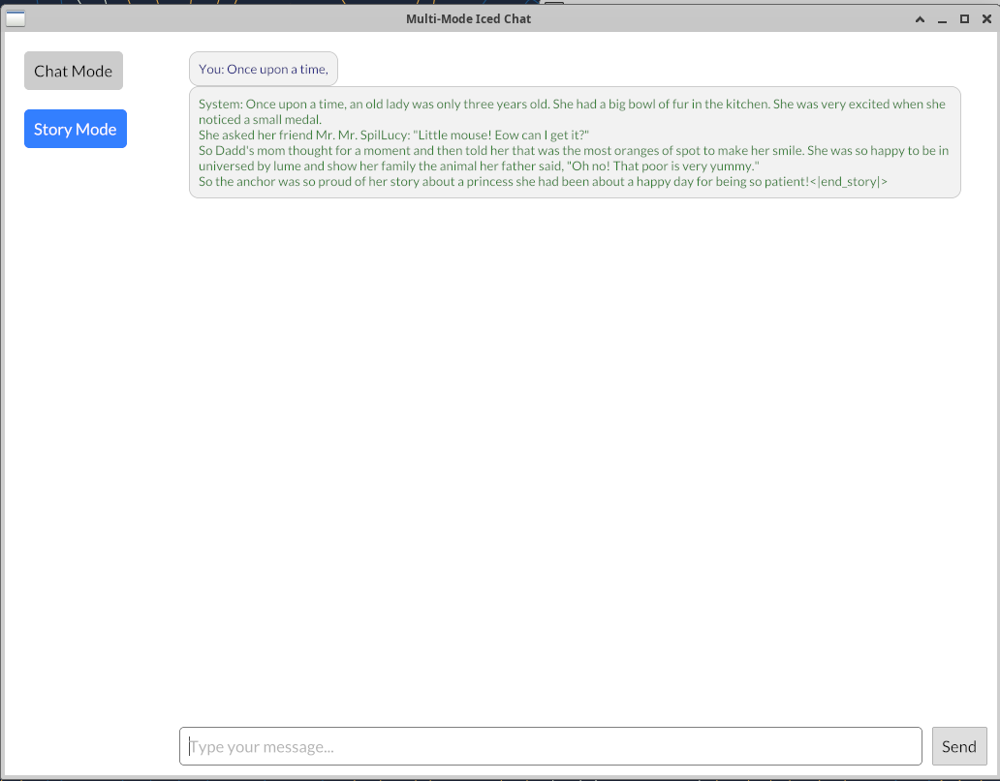

# 简单大模型推理系统实验报告
## 1.基础代码部分
**swiglu**算子：直接根据公式对Tensor内数据操作

**rms_norm**算子：根据最后一维数据进行计算,

矩阵乘算子：根据提示实现二维矩阵乘法

**mlp**: 根据模型调用之前编写的算子即可

## 2.self-attention
对每个kv头和对应Q组，进行Q和K的点积运算，应用提供的masked-softmax函数确保只关注历史信息，将注意力权重值与V相乘，累加得到输出张量。调试好后编写生成函数即可进行故事续写：


## 3.AI对话功能
重写llama模型的参数读入函数，generate函数，在main文件参考story函数编写chat函数，在chat函数实现cache，每次调用生成函数时传入cache，实现cache复用，下面是AI对话功能实现效果:

1[Chat](repo/Chat.png "Chat")

## 4.可视化界面
采用iced库进行开发，将chat模型提前部署在前端部分创建可复用cache,最终实现效果如下图所示，可以通过点击进行模型切换。

Cargo.toml添加如下依赖
```angular2html
iced = "0.4"
```
可视化效果如下图所示:



